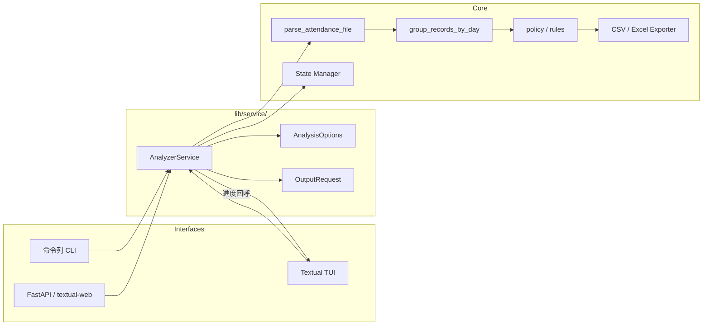
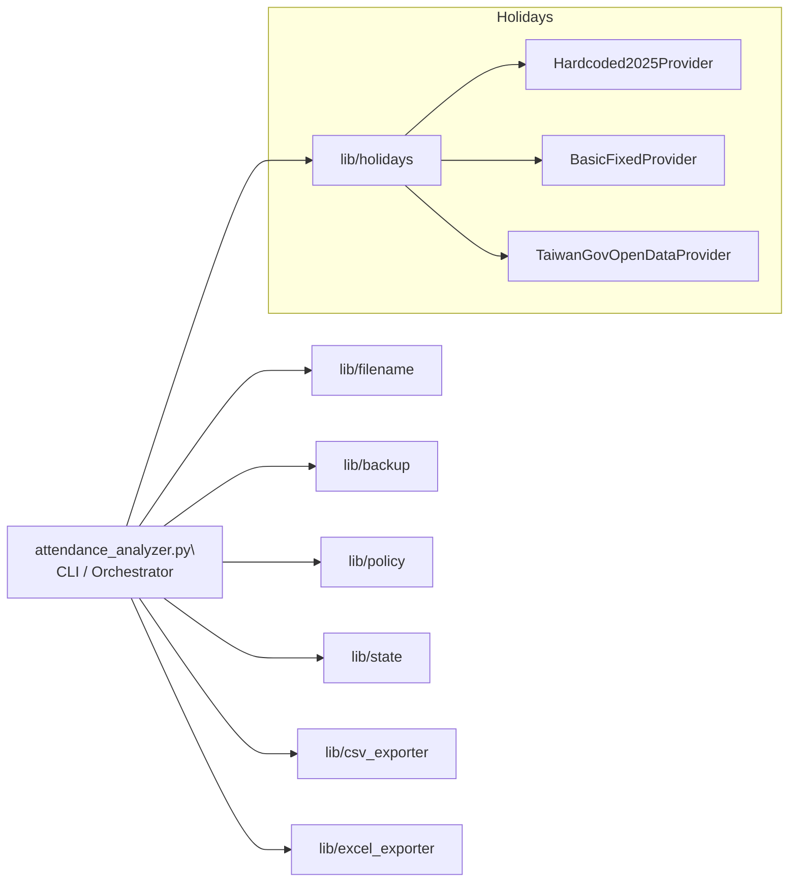

# 系統架構（Architecture）

## Before（單檔為主）
```
attendance_analyzer.py
├── AttendanceRecord / WorkDay / Issue
├── AttendanceStateManager
└── AttendanceAnalyzer（解析、分組、分析、匯出、假日、備份）
```

## 從 `feat/tui` 分支遷移注意事項

- 舊分支中的 `textual/` 目錄已統合至 `tui/`，請改用 `python -m tui` 作為啟動入口，並更新任何 `textual run` 指令。
- 若自訂表單流程或色票，請改寫為 Textual `Design Tokens` 與 `AnalysisForm` 元件；舊的 Panel / Layout 定義已棄用。
- 服務呼叫應改為 `AnalyzerService.run()`，並透過 `AnalysisOptions.from_form()` 建構選項；避免直接引用過去的 `AttendanceAnalyzer` 單例。
- textual-web 原先的自訂啟動腳本已被 `--webview` 旗標取代，部署時請參照 [`docs/usage.md`](usage.md#textual-tui-操作) 的安全建議。
- 若在舊分支建立了錄影素材或自動化腳本，請重新對照 [`docs/tui_capture_setup.md`](tui_capture_setup.md) 更新螢幕尺寸與輸出路徑，確保與最新介面一致。

## After（模組化）
```
attendance_analyzer.py  # Orchestrator（CLI、流程控制、報告匯總）
└── 使用 lib/* 模組：
    ├── lib/filename.py        # parse_range_and_user()
    ├── lib/backup.py          # backup_with_timestamp()
    ├── lib/policy.py          # Rules + 遲到/加班/曠職 純計算
    ├── lib/state.py           # AttendanceStateManager（JSON 持久化）
    ├── lib/csv_exporter.py    # CSV 標頭/狀態列/資料列/存檔
    ├── lib/excel_exporter.py  # Excel 初始化/標頭/資料列/欄寬/存檔
    └── lib/holidays.py        # HolidayProvider + HolidayService（2025/基本/政府開放資料）
```

## 共用服務層（AnalyzerService）



- 服務層集中處理選項驗證、進度回呼、取消控制與匯出請求，確保三種介面共享相同行為。
- TUI 與 textual-web 前端不直接操作底層模組，而是透過 `AnalyzerService.run()` 取得 `AnalysisResult`、預覽資料與匯出資訊。
- 若需新增整合（例如排程、批次腳本），只要建立 `AnalysisOptions` 與 `OutputRequest` 即可重用相同流程。



