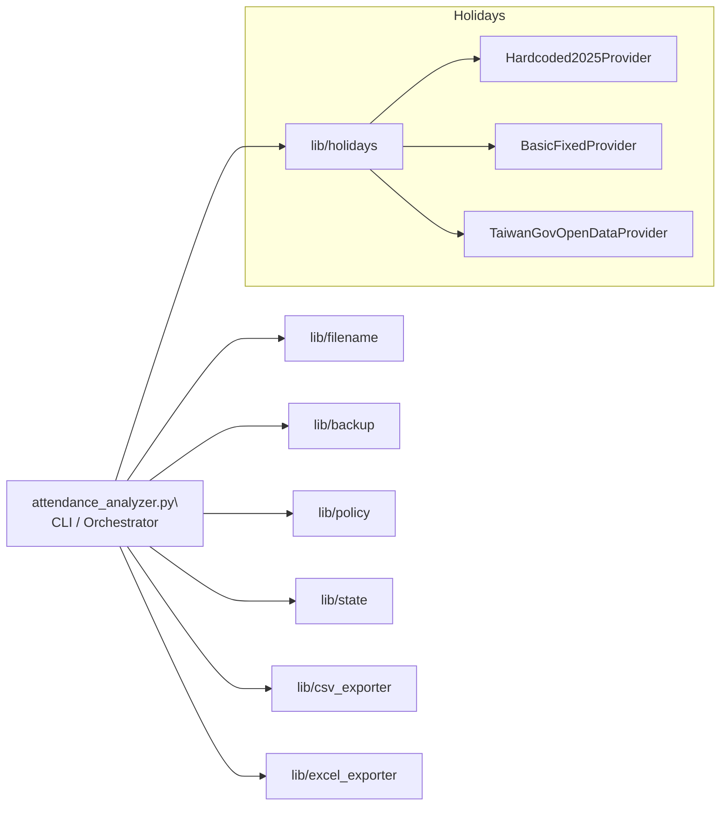

# 系統架構（Architecture）

## Before（單檔為主）
```
attendance_analyzer.py
├── AttendanceRecord / WorkDay / Issue
├── AttendanceStateManager
└── AttendanceAnalyzer（解析、分組、分析、匯出、假日、備份）
```

## After（模組化）
```
attendance_analyzer.py  # Orchestrator（CLI、流程控制、報告匯總）
└── 使用 lib/* 模組：
    ├── lib/filename.py        # parse_range_and_user()
    ├── lib/backup.py          # backup_with_timestamp()
    ├── lib/policy.py          # Rules + 遲到/加班/曠職 純計算
    ├── lib/state.py           # AttendanceStateManager（JSON 持久化）
    ├── lib/csv_exporter.py    # CSV 標頭/狀態列/資料列/存檔
    ├── lib/excel_exporter.py  # Excel 初始化/標頭/資料列/欄寬/存檔
    └── lib/holidays.py        # HolidayProvider + HolidayService（2025/基本/政府開放資料）
```



