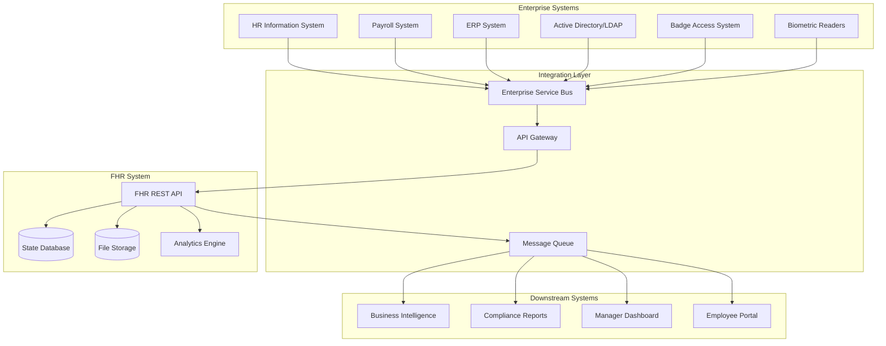

# Enterprise Integration Architecture

## Overview

The FHR attendance analysis system is designed to integrate seamlessly with enterprise HR ecosystems. This document outlines integration patterns, data flows, and implementation strategies for common enterprise scenarios.

## Integration Architecture Patterns

### 1. Hub-and-Spoke Integration Model



### 2. Data Flow Integration Patterns

#### Real-time Data Ingestion
```yaml
# Kafka/Pulsar integration configuration
data_ingestion:
  sources:
    - name: "badge_system_events"
      type: "kafka"
      topic: "attendance.badge.events"
      schema_registry: "https://schema-registry.company.com"
      format: "avro"
      
    - name: "biometric_events" 
      type: "pulsar"
      topic: "attendance.biometric.events"
      format: "json"
      
    - name: "hr_employee_updates"
      type: "rest_webhook"
      endpoint: "/api/v2/webhooks/employee-updates"
      authentication: "hmac_sha256"

  transformations:
    - name: "normalize_timestamps"
      function: "convert_to_utc"
      
    - name: "employee_lookup"
      function: "enrich_with_employee_data"
      cache_ttl: 3600
      
    - name: "attendance_classification" 
      function: "classify_attendance_event"
      rules_engine: "drools"

  destinations:
    - name: "fhr_analysis_queue"
      type: "rabbitmq"
      queue: "fhr.analysis.pending"
      routing_key: "attendance.analyze"
```

## Integration Implementation Templates

### 1. HRIS Integration (SAP SuccessFactors, Workday, Oracle HCM)

#### Employee Data Synchronization
```python
from typing import List, Optional
from dataclasses import dataclass
from datetime import datetime, date
import asyncio
import aiohttp

@dataclass
class EmployeeRecord:
    employee_id: str
    name: str
    department: str
    manager_id: Optional[str]
    work_schedule: str  # "flexible", "fixed", "shift"
    start_date: date
    employment_status: str  # "active", "inactive", "terminated"
    timezone: str
    work_location: str  # "office", "remote", "hybrid"

class HRISIntegration:
    def __init__(self, hris_config: dict):
        self.base_url = hris_config["base_url"]
        self.auth_config = hris_config["auth"]
        self.rate_limits = hris_config.get("rate_limits", {})
        
    async def sync_employees(self, last_sync: Optional[datetime] = None) -> List[EmployeeRecord]:
        """
        Synchronize employee data from HRIS system.
        
        Supports incremental sync based on last_sync timestamp.
        Handles pagination and rate limiting automatically.
        """
        employees = []
        page = 1
        page_size = 100
        
        while True:
            params = {
                "page": page,
                "page_size": page_size,
                "modified_since": last_sync.isoformat() if last_sync else None
            }
            
            async with aiohttp.ClientSession() as session:
                response = await session.get(
                    f"{self.base_url}/api/employees",
                    params=params,
                    headers=await self._get_auth_headers()
                )
                
                if response.status != 200:
                    break
                    
                data = await response.json()
                page_employees = [self._parse_employee(emp) for emp in data["employees"]]
                employees.extend(page_employees)
                
                if len(page_employees) < page_size:
                    break
                    
                page += 1
                
                # Rate limiting
                await asyncio.sleep(self.rate_limits.get("request_delay", 0.1))
        
        return employees
    
    async def _get_auth_headers(self) -> dict:
        """Handle various authentication methods (OAuth2, API Key, SAML)."""
        auth_type = self.auth_config["type"]
        
        if auth_type == "oauth2":
            token = await self._refresh_oauth_token()
            return {"Authorization": f"Bearer {token}"}
        elif auth_type == "api_key":
            return {"X-API-Key": self.auth_config["api_key"]}
        elif auth_type == "basic":
            import base64
            credentials = base64.b64encode(
                f"{self.auth_config['username']}:{self.auth_config['password']}".encode()
            ).decode()
            return {"Authorization": f"Basic {credentials}"}
        
    def _parse_employee(self, emp_data: dict) -> EmployeeRecord:
        """Parse HRIS-specific employee data format."""
        return EmployeeRecord(
            employee_id=emp_data["id"],
            name=emp_data["displayName"],
            department=emp_data.get("department", {}).get("name", "Unknown"),
            manager_id=emp_data.get("manager", {}).get("id"),
            work_schedule=self._map_work_schedule(emp_data.get("workArrangement")),
            start_date=datetime.fromisoformat(emp_data["startDate"]).date(),
            employment_status=emp_data.get("employmentStatus", "active").lower(),
            timezone=emp_data.get("timezone", "Asia/Taipei"),
            work_location=self._map_work_location(emp_data.get("workLocation"))
        )
```

#### Attendance Data Push
```python
class AttendanceDataPush:
    def __init__(self, fhr_client, hris_client):
        self.fhr = fhr_client
        self.hris = hris_client
    
    async def push_analysis_results(self, analysis_results: dict) -> bool:
        """
        Push FHR analysis results back to HRIS system.
        
        Transforms FHR format to HRIS-expected format.
        Handles retry logic and error reporting.
        """
        try:
            # Transform FHR results to HRIS format
            hris_payload = self._transform_to_hris_format(analysis_results)
            
            # Validate payload against HRIS schema
            if not self._validate_hris_payload(hris_payload):
                raise ValueError("Invalid payload format for HRIS")
            
            # Push to HRIS
            response = await self.hris.post_attendance_data(hris_payload)
            
            # Handle HRIS-specific response codes
            if response.status_code == 202:
                # Async processing - monitor status
                return await self._monitor_hris_processing(response.json()["batch_id"])
            elif response.status_code == 200:
                return True
            else:
                await self._handle_push_error(response)
                return False
                
        except Exception as e:
            await self._log_integration_error("hris_push", str(e), analysis_results["analysis_id"])
            return False
    
    def _transform_to_hris_format(self, fhr_results: dict) -> dict:
        """Transform FHR analysis results to HRIS-expected format."""
        return {
            "batch_id": f"fhr_{fhr_results['analysis_id']}",
            "source_system": "fhr_attendance_analyzer",
            "processing_date": datetime.utcnow().isoformat(),
            "employee_id": fhr_results["user"], 
            "period_start": fhr_results.get("period_start"),
            "period_end": fhr_results.get("period_end"),
            "attendance_events": [
                {
                    "event_date": issue["date"],
                    "event_type": self._map_issue_type_to_hris(issue["type"]),
                    "duration_minutes": issue["duration_minutes"],
                    "description": issue["description"],
                    "requires_approval": issue["type"] in ["LATE", "OVERTIME"],
                    "auto_approved": issue["type"] in ["FORGET_PUNCH"],
                    "metadata": {
                        "fhr_calculation": issue.get("calculation"),
                        "fhr_time_range": issue.get("time_range"),
                        "fhr_status": issue.get("status")
                    }
                }
                for issue in fhr_results["issues_preview"]
            ]
        }
```

### 2. Payroll System Integration

#### Time Tracking Data Export
```python
class PayrollIntegration:
    """
    Integration with payroll systems (ADP, Paychex, QuickBooks, local systems).
    
    Exports attendance analysis results in payroll-compatible formats.
    """
    
    def __init__(self, payroll_config: dict):
        self.config = payroll_config
        self.format_handlers = {
            "adp": self._format_for_adp,
            "paychex": self._format_for_paychex, 
            "quickbooks": self._format_for_quickbooks,
            "csv_generic": self._format_generic_csv,
            "xml_generic": self._format_generic_xml
        }
    
    async def export_for_payroll(self, analysis_results: dict, period_start: date, period_end: date) -> dict:
        """
        Export FHR analysis results for payroll processing.
        
        Returns both regular time and overtime calculations.
        """
        format_type = self.config["format"]
        
        if format_type not in self.format_handlers:
            raise ValueError(f"Unsupported payroll format: {format_type}")
        
        # Calculate payroll-relevant metrics
        payroll_data = self._calculate_payroll_metrics(analysis_results, period_start, period_end)
        
        # Format according to target system
        formatted_data = self.format_handlers[format_type](payroll_data)
        
        # Validate export
        validation_result = self._validate_payroll_export(formatted_data, format_type)
        
        return {
            "export_id": f"payroll_{datetime.utcnow().strftime('%Y%m%d_%H%M%S')}",
            "format": format_type,
            "period_start": period_start.isoformat(),
            "period_end": period_end.isoformat(),
            "employee_count": len(payroll_data["employees"]),
            "total_regular_hours": payroll_data["totals"]["regular_hours"],
            "total_overtime_hours": payroll_data["totals"]["overtime_hours"],
            "data": formatted_data,
            "validation": validation_result,
            "export_timestamp": datetime.utcnow().isoformat()
        }
    
    def _calculate_payroll_metrics(self, analysis_results: dict, start_date: date, end_date: date) -> dict:
        """Calculate hours worked, overtime, deductions for payroll."""
        
        # Taiwan-specific calculation rules
        standard_work_hours_per_day = 8
        overtime_threshold_minutes = 60  # Minimum overtime to count
        lunch_deduction_minutes = 60
        
        employees = {}
        
        for issue in analysis_results.get("issues_preview", []):
            employee_id = analysis_results["user"]
            
            if employee_id not in employees:
                employees[employee_id] = {
                    "employee_id": employee_id,
                    "regular_hours": 0,
                    "overtime_hours": 0,
                    "late_deductions": 0,
                    "forget_punch_count": 0,
                    "wfh_days": 0,
                    "leave_days": 0,
                    "working_days": 0
                }
            
            emp = employees[employee_id]
            
            if issue["type"] == "OVERTIME" and issue["duration_minutes"] >= overtime_threshold_minutes:
                emp["overtime_hours"] += issue["duration_minutes"] / 60
            elif issue["type"] == "LATE":
                # Deduct late time from regular hours
                emp["late_deductions"] += issue["duration_minutes"] / 60
            elif issue["type"] == "FORGET_PUNCH":
                emp["forget_punch_count"] += 1
            elif issue["type"] == "WFH":
                emp["wfh_days"] += 1
                emp["working_days"] += 1
            elif issue["type"] == "WEEKDAY_LEAVE":
                emp["leave_days"] += 1
        
        # Calculate total working days and regular hours
        total_work_days = self._calculate_work_days(start_date, end_date)
        
        for emp in employees.values():
            # Regular hours = (total work days - leave days) * 8 hours - late deductions
            emp["working_days"] = total_work_days - emp["leave_days"]
            emp["regular_hours"] = max(0, emp["working_days"] * standard_work_hours_per_day - emp["late_deductions"])
        
        return {
            "employees": employees,
            "period": {"start": start_date, "end": end_date},
            "totals": {
                "regular_hours": sum(emp["regular_hours"] for emp in employees.values()),
                "overtime_hours": sum(emp["overtime_hours"] for emp in employees.values()),
                "total_employees": len(employees)
            }
        }
    
    def _format_for_adp(self, payroll_data: dict) -> str:
        """Format data for ADP payroll system."""
        # ADP-specific fixed-width format
        output_lines = []
        
        for employee in payroll_data["employees"].values():
            line = (
                f"{employee['employee_id']:<10}"
                f"{employee['regular_hours']:>8.2f}"
                f"{employee['overtime_hours']:>8.2f}"
                f"{payroll_data['period']['start'].strftime('%m%d%Y')}"
                f"{payroll_data['period']['end'].strftime('%m%d%Y')}"
            )
            output_lines.append(line)
        
        return "\n".join(output_lines)
    
    def _format_for_quickbooks(self, payroll_data: dict) -> str:
        """Format data for QuickBooks payroll import."""
        import csv
        import io
        
        output = io.StringIO()
        writer = csv.writer(output)
        
        # QuickBooks header
        writer.writerow([
            "Employee", "Date", "Service Item", "Payroll Item", 
            "Duration", "Rate", "Amount", "Billable Status"
        ])
        
        for employee in payroll_data["employees"].values():
            # Regular hours
            writer.writerow([
                employee["employee_id"],
                payroll_data["period"]["end"].strftime("%m/%d/%Y"),
                "Regular Hours",
                "Regular Pay",
                employee["regular_hours"],
                "",  # Rate filled by QB
                "",  # Amount calculated by QB
                "Not Billable"
            ])
            
            # Overtime hours
            if employee["overtime_hours"] > 0:
                writer.writerow([
                    employee["employee_id"],
                    payroll_data["period"]["end"].strftime("%m/%d/%Y"),
                    "Overtime Hours",
                    "Overtime Pay",
                    employee["overtime_hours"],
                    "",
                    "",
                    "Not Billable"
                ])
        
        return output.getvalue()
```

### 3. Enterprise Security Integration

#### Single Sign-On (SSO) Integration
```python
from typing import Optional
import jwt
import requests
from datetime import datetime, timedelta

class SSOIntegration:
    """
    Integrate FHR with enterprise SSO systems (SAML, OAuth2, OIDC).
    """
    
    def __init__(self, sso_config: dict):
        self.config = sso_config
        self.provider_type = sso_config["provider"]  # "azure_ad", "okta", "saml", "oidc"
        
    async def authenticate_user(self, token: str) -> Optional[dict]:
        """
        Authenticate user against enterprise SSO system.
        
        Returns user information if authentication successful.
        """
        if self.provider_type == "azure_ad":
            return await self._authenticate_azure_ad(token)
        elif self.provider_type == "okta":
            return await self._authenticate_okta(token)
        elif self.provider_type == "saml":
            return await self._authenticate_saml(token)
        elif self.provider_type == "oidc":
            return await self._authenticate_oidc(token)
        else:
            raise ValueError(f"Unsupported SSO provider: {self.provider_type}")
    
    async def _authenticate_azure_ad(self, token: str) -> Optional[dict]:
        """Authenticate against Azure AD."""
        try:
            # Verify JWT token
            header = jwt.get_unverified_header(token)
            kid = header["kid"]
            
            # Get public key from Azure AD
            keys_url = f"https://login.microsoftonline.com/{self.config['tenant_id']}/discovery/v2.0/keys"
            response = requests.get(keys_url)
            keys = response.json()["keys"]
            
            public_key = None
            for key in keys:
                if key["kid"] == kid:
                    public_key = jwt.algorithms.RSAAlgorithm.from_jwk(key)
                    break
            
            if not public_key:
                return None
            
            # Verify and decode token
            payload = jwt.decode(
                token,
                public_key,
                algorithms=["RS256"],
                audience=self.config["client_id"],
                issuer=f"https://login.microsoftonline.com/{self.config['tenant_id']}/v2.0"
            )
            
            # Extract user information
            return {
                "user_id": payload["oid"],
                "email": payload.get("email", payload.get("preferred_username")),
                "name": payload.get("name"),
                "groups": payload.get("groups", []),
                "tenant_id": payload.get("tid"),
                "expires_at": datetime.fromtimestamp(payload["exp"])
            }
            
        except Exception as e:
            print(f"Azure AD authentication failed: {e}")
            return None
    
    def get_user_permissions(self, user_info: dict) -> dict:
        """
        Determine user permissions based on SSO groups/roles.
        
        Maps enterprise groups to FHR permissions.
        """
        permissions = {
            "can_upload": False,
            "can_view_all_users": False,
            "can_export": False,
            "can_admin": False,
            "accessible_departments": [],
            "max_file_size_mb": 10
        }
        
        user_groups = user_info.get("groups", [])
        
        # Map enterprise groups to FHR permissions
        group_mappings = self.config.get("group_mappings", {})
        
        for group_id in user_groups:
            if group_id in group_mappings:
                group_perms = group_mappings[group_id]
                permissions.update(group_perms)
        
        return permissions
```

#### Audit Logging Integration
```python
class AuditLogger:
    """
    Enterprise audit logging for compliance and security monitoring.
    
    Integrates with SIEM systems (Splunk, ELK, QRadar, Sentinel).
    """
    
    def __init__(self, audit_config: dict):
        self.config = audit_config
        self.targets = audit_config.get("targets", [])
        
    async def log_event(self, event_type: str, user_info: dict, event_data: dict, risk_level: str = "LOW"):
        """
        Log security/compliance events to enterprise systems.
        """
        event = {
            "timestamp": datetime.utcnow().isoformat(),
            "system": "fhr_attendance_analyzer",
            "event_type": event_type,
            "risk_level": risk_level,
            "user": {
                "id": user_info.get("user_id"),
                "email": user_info.get("email"),
                "tenant": user_info.get("tenant_id"),
                "ip_address": event_data.get("ip_address"),
                "user_agent": event_data.get("user_agent")
            },
            "event_data": event_data,
            "compliance_tags": self._get_compliance_tags(event_type)
        }
        
        # Send to configured audit targets
        for target in self.targets:
            await self._send_to_target(target, event)
    
    def _get_compliance_tags(self, event_type: str) -> List[str]:
        """Get compliance tags based on event type."""
        tag_mapping = {
            "file_upload": ["PII", "DATA_PROCESSING"],
            "analysis_complete": ["ATTENDANCE_DATA", "AUTOMATED_PROCESSING"],
            "export_data": ["DATA_EXPORT", "PII"],
            "user_login": ["AUTHENTICATION", "ACCESS_CONTROL"],
            "permission_denied": ["SECURITY", "ACCESS_CONTROL"],
            "data_retention_cleanup": ["DATA_LIFECYCLE", "PRIVACY"]
        }
        return tag_mapping.get(event_type, [])
    
    async def _send_to_target(self, target: dict, event: dict):
        """Send audit event to specific target system."""
        target_type = target["type"]
        
        if target_type == "splunk":
            await self._send_to_splunk(target, event)
        elif target_type == "elk":
            await self._send_to_elasticsearch(target, event)
        elif target_type == "syslog":
            await self._send_to_syslog(target, event)
        elif target_type == "webhook":
            await self._send_to_webhook(target, event)
```

## Integration Testing Framework

### 1. Mock Enterprise Systems
```python
import pytest
from unittest.mock import AsyncMock, MagicMock
from fastapi.testclient import TestClient

@pytest.fixture
def mock_hris_system():
    """Mock HRIS system for integration testing."""
    mock = AsyncMock()
    
    # Mock employee data responses
    mock.get_employees.return_value = [
        {
            "id": "EMP001",
            "displayName": "張三",
            "department": {"name": "Engineering"},
            "workArrangement": "flexible",
            "startDate": "2024-01-01T00:00:00Z",
            "timezone": "Asia/Taipei"
        }
    ]
    
    mock.post_attendance_data.return_value = MagicMock(
        status_code=202,
        json=lambda: {"batch_id": "batch_123", "status": "processing"}
    )
    
    return mock

@pytest.fixture 
def mock_payroll_system():
    """Mock payroll system for integration testing."""
    mock = AsyncMock()
    
    mock.import_timesheet_data.return_value = {
        "import_id": "import_456",
        "status": "success",
        "records_processed": 15
    }
    
    return mock

class TestEnterpriseIntegration:
    """Test enterprise system integrations."""
    
    @pytest.mark.asyncio
    async def test_hris_employee_sync(self, mock_hris_system):
        """Test employee synchronization from HRIS."""
        integration = HRISIntegration({"base_url": "https://mock-hris.com"})
        integration.hris_client = mock_hris_system
        
        employees = await integration.sync_employees()
        
        assert len(employees) == 1
        assert employees[0].name == "張三"
        assert employees[0].department == "Engineering"
        mock_hris_system.get_employees.assert_called_once()
    
    @pytest.mark.asyncio
    async def test_payroll_export(self, mock_payroll_system):
        """Test payroll data export."""
        payroll_integration = PayrollIntegration({"format": "adp"})
        
        analysis_results = {
            "user": "張三",
            "issues_preview": [
                {
                    "date": "2024-03-15",
                    "type": "OVERTIME",
                    "duration_minutes": 90,
                    "description": "加班90分鐘"
                }
            ]
        }
        
        export_result = await payroll_integration.export_for_payroll(
            analysis_results, 
            date(2024, 3, 1), 
            date(2024, 3, 31)
        )
        
        assert export_result["format"] == "adp"
        assert export_result["total_overtime_hours"] == 1.5
    
    def test_sso_authentication_flow(self):
        """Test SSO authentication integration."""
        client = TestClient(app)
        
        # Mock JWT token
        mock_token = "mock_jwt_token"
        
        response = client.post(
            "/api/v2/analyze",
            headers={"Authorization": f"Bearer {mock_token}"},
            files={"file": ("test.txt", "sample data", "text/plain")},
            data={"mode": "incremental"}
        )
        
        # Should handle authentication (mock will determine success/failure)
        assert response.status_code in [200, 401, 403]
```

This enterprise integration documentation provides comprehensive patterns for connecting FHR with typical enterprise systems while maintaining security, compliance, and operational requirements.