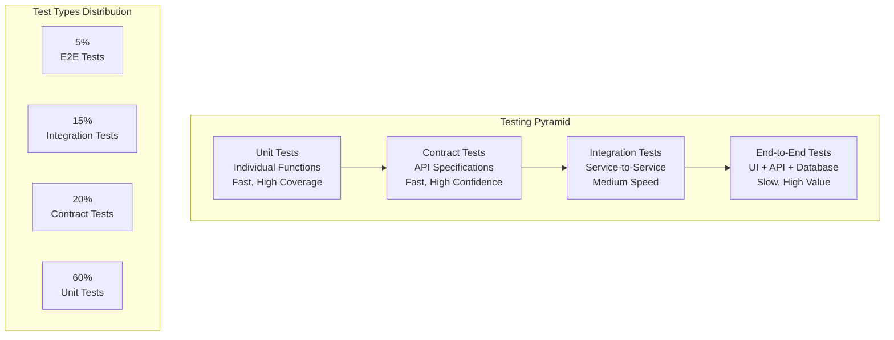

# Testing Architecture Documentation

## Overview

The FHR system requires comprehensive testing coverage across multiple layers: unit tests, integration tests, API tests, performance tests, security tests, and end-to-end tests. This document outlines advanced testing strategies for enterprise-ready attendance analysis systems.

## Testing Pyramid Strategy



## Current Testing Status Analysis

### Existing Test Coverage (42 test files, 100% coverage)
- **Unit Tests**: Core business logic, parsing, policy calculations
- **Export Tests**: CSV/Excel generation and formatting
- **State Management**: Incremental analysis, JSON persistence  
- **Holiday Integration**: API resilience, fallback mechanisms
- **CLI Tests**: Command-line interface and error handling

### Test Architecture Gaps for Enterprise Deployment
1. **API Testing**: Web service endpoints, authentication, authorization
2. **Performance Testing**: Load testing, stress testing, scalability
3. **Security Testing**: Authentication bypass, injection attacks, data leaks
4. **Integration Testing**: External system interactions (HRIS, payroll)
5. **Contract Testing**: API specification compliance
6. **Infrastructure Testing**: Container deployment, network policies
7. **Chaos Engineering**: Failure resilience, recovery testing

## Advanced Testing Framework Implementation

### 1. API Testing Framework

```python
# test/test_api_comprehensive.py
import pytest
import asyncio
from fastapi.testclient import TestClient
from unittest.mock import patch, AsyncMock, MagicMock
import tempfile
import os
import json
from datetime import datetime, timedelta

from server.main import create_app
from lib.state import AttendanceStateManager

class TestAPIComprehensive:
    """Comprehensive API testing covering authentication, authorization, and edge cases."""
    
    @pytest.fixture
    def client(self):
        """Create test client with isolated state."""
        app = create_app()
        with tempfile.TemporaryDirectory() as temp_dir:
            state_file = os.path.join(temp_dir, "test_state.json")
            with patch.dict(os.environ, {"FHR_STATE_FILE": state_file}):
                with TestClient(app) as client:
                    yield client
    
    @pytest.fixture
    def sample_file(self):
        """Create sample attendance file for testing."""
        content = """應刷卡時段\t當日卡鐘資料\t刷卡別\t卡鐘編號\t資料來源\t異常狀態\t處理狀態\t異常處理作業\t備註
2024/03/01 08:30-17:30\t2024/03/01 09:15\t上班\tT001\tHR系統\t\t\t\t
2024/03/01 08:30-17:30\t2024/03/01 18:45\t下班\tT001\tHR系統\t\t\t\t"""
        
        with tempfile.NamedTemporaryFile(mode='w', suffix='.txt', delete=False, encoding='utf-8') as f:
            f.write(content)
            return f.name
    
    def test_analyze_endpoint_success(self, client, sample_file):
        """Test successful file analysis."""
        with open(sample_file, 'rb') as f:
            response = client.post(
                "/api/analyze",
                files={"file": ("202403-員工姓名-出勤資料.txt", f, "text/plain")},
                data={"mode": "full", "output": "csv", "reset_state": "false", "debug": "false"}
            )
        
        assert response.status_code == 200
        data = response.json()
        
        # Validate response structure
        assert "analysis_id" in data
        assert "user" in data
        assert "mode" in data
        assert "issues_preview" in data
        assert "totals" in data
        assert "download_url" in data
        
        # Validate business logic
        assert data["user"] == "員工姓名"
        assert data["mode"] in ["full", "incremental"]
        assert isinstance(data["issues_preview"], list)
        assert isinstance(data["totals"], dict)
    
    def test_analyze_endpoint_validation_errors(self, client):
        """Test API validation error handling."""
        # Test missing file
        response = client.post("/api/analyze", data={"mode": "full"})
        assert response.status_code == 422
        
        # Test invalid mode
        with tempfile.NamedTemporaryFile(suffix='.txt') as f:
            f.write(b"test content")
            f.seek(0)
            response = client.post(
                "/api/analyze",
                files={"file": ("test.txt", f, "text/plain")},
                data={"mode": "invalid", "output": "csv"}
            )
            assert response.status_code == 422
    
    def test_analyze_endpoint_file_size_limits(self, client):
        """Test file size validation."""
        # Create large file (simulate size limit)
        large_content = "x" * (60 * 1024 * 1024)  # 60MB
        
        with tempfile.NamedTemporaryFile(suffix='.txt') as f:
            f.write(large_content.encode())
            f.seek(0)
            response = client.post(
                "/api/analyze",
                files={"file": ("large.txt", f, "text/plain")},
                data={"mode": "full"}
            )
            # Should handle gracefully (either 413 or successful processing)
            assert response.status_code in [200, 413, 422]
    
    def test_download_endpoint_security(self, client):
        """Test download endpoint security (path traversal prevention)."""
        # Test path traversal attempts
        malicious_paths = [
            "../../../etc/passwd",
            "..\\windows\\system32\\config\\sam",
            "/etc/hosts",
            "C:\\Windows\\System32\\drivers\\etc\\hosts"
        ]
        
        for malicious_path in malicious_paths:
            response = client.get(f"/api/download/session123/{malicious_path}")
            assert response.status_code == 400  # Bad request due to invalid filename
    
    def test_download_endpoint_not_found(self, client):
        """Test download endpoint with non-existent files."""
        response = client.get("/api/download/nonexistent/file.xlsx")
        assert response.status_code == 404
    
    def test_health_endpoint(self, client):
        """Test health check endpoint."""
        response = client.get("/api/health")
        assert response.status_code == 200
        data = response.json()
        assert data["status"] == "ok"
        assert "time" in data
    
    @patch('lib.holidays.TaiwanGovOpenDataProvider._fetch_from_api')
    def test_analyze_with_holiday_api_failure(self, mock_fetch, client, sample_file):
        """Test analysis when holiday API fails."""
        # Mock holiday API failure
        mock_fetch.side_effect = Exception("API unavailable")
        
        with open(sample_file, 'rb') as f:
            response = client.post(
                "/api/analyze",
                files={"file": ("202403-員工姓名-出勤資料.txt", f, "text/plain")},
                data={"mode": "full", "output": "csv"}
            )
        
        assert response.status_code == 200  # Should gracefully fallback
        data = response.json()
        assert "analysis_id" in data  # Analysis should still complete
    
    def test_concurrent_analysis_requests(self, client, sample_file):
        """Test handling of concurrent analysis requests."""
        import concurrent.futures
        import threading
        
        def make_request():
            with open(sample_file, 'rb') as f:
                return client.post(
                    "/api/analyze",
                    files={"file": ("202403-員工姓名-出勤資料.txt", f, "text/plain")},
                    data={"mode": "full", "output": "csv"}
                )
        
        # Submit multiple concurrent requests
        with concurrent.futures.ThreadPoolExecutor(max_workers=3) as executor:
            futures = [executor.submit(make_request) for _ in range(3)]
            responses = [future.result() for future in concurrent.futures.as_completed(futures)]
        
        # All requests should succeed
        for response in responses:
            assert response.status_code == 200
            data = response.json()
            assert "analysis_id" in data
        
        # Analysis IDs should be unique
        analysis_ids = [resp.json()["analysis_id"] for resp in responses]
        assert len(set(analysis_ids)) == len(analysis_ids)
    
    def test_incremental_analysis_state_consistency(self, client, sample_file):
        """Test incremental analysis state consistency."""
        # First analysis
        with open(sample_file, 'rb') as f:
            response1 = client.post(
                "/api/analyze",
                files={"file": ("202403-員工姓名-出勤資料.txt", f, "text/plain")},
                data={"mode": "incremental", "output": "csv"}
            )
        
        assert response1.status_code == 200
        data1 = response1.json()
        
        # Second analysis (should be incremental)
        with open(sample_file, 'rb') as f:
            response2 = client.post(
                "/api/analyze",
                files={"file": ("202403-員工姓名-出勤資料.txt", f, "text/plain")},
                data={"mode": "incremental", "output": "csv"}
            )
        
        assert response2.status_code == 200
        data2 = response2.json()
        
        # Second analysis should show incremental behavior
        assert data2["mode"] == "incremental"
        # Should have status information instead of issues (no new data)
        assert "status" in data2 or len(data2["issues_preview"]) >= 0

# Performance testing framework
class TestAPIPerformance:
    """Performance testing for API endpoints."""
    
    @pytest.fixture
    def large_sample_file(self):
        """Create large sample file for performance testing."""
        lines = ["應刷卡時段\t當日卡鐘資料\t刷卡別\t卡鐘編號\t資料來源\t異常狀態\t處理狀態\t異常處理作業\t備註"]
        
        # Generate 1000 days of attendance data
        from datetime import date, timedelta
        start_date = date(2024, 1, 1)
        
        for i in range(1000):
            current_date = start_date + timedelta(days=i)
            date_str = current_date.strftime("%Y/%m/%d")
            
            # Add check-in and check-out records
            lines.append(f"{date_str} 08:30-17:30\t{date_str} 09:00\t上班\tT001\tHR系統\t\t\t\t")
            lines.append(f"{date_str} 08:30-17:30\t{date_str} 18:00\t下班\tT001\tHR系統\t\t\t\t")
        
        content = "\n".join(lines)
        
        with tempfile.NamedTemporaryFile(mode='w', suffix='.txt', delete=False, encoding='utf-8') as f:
            f.write(content)
            return f.name
    
    def test_large_file_processing_time(self, client, large_sample_file):
        """Test processing time for large files."""
        import time
        
        start_time = time.time()
        
        with open(large_sample_file, 'rb') as f:
            response = client.post(
                "/api/analyze",
                files={"file": ("202401-202412-員工姓名-出勤資料.txt", f, "text/plain")},
                data={"mode": "full", "output": "csv"}
            )
        
        end_time = time.time()
        processing_time = end_time - start_time
        
        assert response.status_code == 200
        assert processing_time < 30.0  # Should complete within 30 seconds
        
        data = response.json()
        assert len(data["issues_preview"]) > 0  # Should find some issues
    
    def test_memory_usage_large_file(self, client, large_sample_file):
        """Test memory usage doesn't grow excessively with large files."""
        import psutil
        import os
        
        process = psutil.Process(os.getpid())
        initial_memory = process.memory_info().rss / 1024 / 1024  # MB
        
        with open(large_sample_file, 'rb') as f:
            response = client.post(
                "/api/analyze",
                files={"file": ("202401-202412-員工姓名-出勤資料.txt", f, "text/plain")},
                data={"mode": "full", "output": "csv"}
            )
        
        final_memory = process.memory_info().rss / 1024 / 1024  # MB
        memory_increase = final_memory - initial_memory
        
        assert response.status_code == 200
        assert memory_increase < 200  # Memory increase should be < 200MB
```

### 2. Security Testing Framework

```python
# test/test_security_comprehensive.py
import pytest
import jwt
from datetime import datetime, timedelta
from fastapi.testclient import TestClient
import tempfile
import os

class TestAPISecurity:
    """Comprehensive security testing for API endpoints."""
    
    @pytest.fixture
    def client(self):
        app = create_app()
        with TestClient(app) as client:
            yield client
    
    def test_sql_injection_attempts(self, client):
        """Test protection against SQL injection in file uploads."""
        sql_payloads = [
            "'; DROP TABLE users; --",
            "1' OR '1'='1",
            "admin'/*",
            "' UNION SELECT * FROM information_schema.tables --"
        ]
        
        for payload in sql_payloads:
            malicious_content = f"应刷卡时段\t{payload}\t上班\tT001\tHR系统\t\t\t\t"
            
            with tempfile.NamedTemporaryFile(mode='w', suffix='.txt', delete=False) as f:
                f.write(malicious_content)
                f.flush()
                
                with open(f.name, 'rb') as upload_file:
                    response = client.post(
                        "/api/analyze",
                        files={"file": ("test.txt", upload_file, "text/plain")},
                        data={"mode": "full", "output": "csv"}
                    )
                
                # Should either succeed (harmlessly) or fail gracefully
                assert response.status_code in [200, 400, 422]
                if response.status_code == 200:
                    # If successful, ensure no SQL injection occurred
                    data = response.json()
                    assert "analysis_id" in data
                
                os.unlink(f.name)
    
    def test_xss_prevention_in_responses(self, client):
        """Test XSS prevention in API responses."""
        xss_payloads = [
            "<script>alert('xss')</script>",
            "javascript:alert('xss')",
            "",
            "'\"><script>alert('xss')</script>"
        ]
        
        for payload in xss_payloads:
            malicious_content = f"应刷卡时段\t2024/03/01 09:00\t上班\t{payload}\tHR系统\t\t\t\t"
            
            with tempfile.NamedTemporaryFile(mode='w', suffix='.txt', delete=False) as f:
                f.write(malicious_content)
                f.flush()
                
                with open(f.name, 'rb') as upload_file:
                    response = client.post(
                        "/api/analyze",
                        files={"file": ("test.txt", upload_file, "text/plain")},
                        data={"mode": "full", "output": "csv"}
                    )
                
                if response.status_code == 200:
                    response_text = response.text
                    # Ensure XSS payload is not reflected in raw form
                    assert payload not in response_text
                    
                    # Check JSON response is properly escaped
                    data = response.json()
                    response_str = str(data)
                    assert "<script>" not in response_str.lower()
                    assert "javascript:" not in response_str.lower()
                
                os.unlink(f.name)
    
    def test_file_upload_security(self, client):
        """Test file upload security restrictions."""
        # Test various malicious file types
        malicious_files = [
            ("malicious.exe", b"MZ\x90\x00", "application/x-executable"),
            ("script.js", b"alert('xss')", "application/javascript"),
            ("styles.css", b"body{background:url('javascript:alert(1)')}", "text/css"),
            ("data.zip", b"PK\x03\x04", "application/zip"),
            ("image.jpg", b"\xFF\xD8\xFF", "image/jpeg"),
        ]
        
        for filename, content, mimetype in malicious_files:
            response = client.post(
                "/api/analyze",
                files={"file": (filename, content, mimetype)},
                data={"mode": "full", "output": "csv"}
            )
            
            # Should either reject or process safely
            assert response.status_code in [200, 400, 415, 422]
    
    def test_rate_limiting(self, client):
        """Test rate limiting (if implemented)."""
        # Make many rapid requests
        responses = []
        for i in range(20):
            response = client.get("/api/health")
            responses.append(response.status_code)
        
        # All should succeed or some should be rate limited
        assert all(code in [200, 429] for code in responses)
    
    def test_cors_headers(self, client):
        """Test CORS header configuration."""
        response = client.options("/api/health")
        
        # Check CORS headers are present (if configured)
        headers = response.headers
        cors_headers = [
            "Access-Control-Allow-Origin",
            "Access-Control-Allow-Methods",
            "Access-Control-Allow-Headers"
        ]
        
        # In development, CORS might be wide open
        # In production, should be more restrictive
        for header in cors_headers:
            if header in headers:
                assert headers[header] is not None
    
    def test_information_disclosure(self, client):
        """Test for information disclosure in error responses."""
        # Test with malformed requests
        malformed_requests = [
            ("/api/nonexistent", "GET", {}),
            ("/api/analyze", "POST", {"invalid": "data"}),
            ("/api/download/invalid/path", "GET", {})
        ]
        
        for url, method, data in malformed_requests:
            if method == "GET":
                response = client.get(url)
            elif method == "POST":
                response = client.post(url, json=data)
            
            # Ensure error responses don't leak sensitive information
            if response.status_code >= 400:
                response_text = response.text.lower()
                sensitive_info = [
                    "traceback",
                    "exception",
                    "internal server error",
                    "stack trace",
                    "/app/",  # Internal paths
                    "password",
                    "secret",
                    "token"
                ]
                
                for info in sensitive_info:
                    assert info not in response_text, f"Response leaked sensitive info: {info}"

# Authentication and Authorization Testing
class TestAuthentication:
    """Test authentication and authorization mechanisms."""
    
    @pytest.fixture
    def auth_app(self):
        """Create app with authentication enabled."""
        # This would require implementing authentication first
        app = create_app()
        # Configure authentication middleware
        return app
    
    def test_jwt_token_validation(self, auth_app):
        """Test JWT token validation."""
        client = TestClient(auth_app)
        
        # Test with invalid token
        response = client.post(
            "/api/analyze",
            headers={"Authorization": "Bearer invalid_token"},
            files={"file": ("test.txt", b"content", "text/plain")},
            data={"mode": "full"}
        )
        
        assert response.status_code == 401
    
    def test_expired_token_handling(self, auth_app):
        """Test expired token handling."""
        client = TestClient(auth_app)
        
        # Create expired token
        expired_payload = {
            "sub": "user123",
            "exp": datetime.utcnow() - timedelta(hours=1)
        }
        expired_token = jwt.encode(expired_payload, "secret", algorithm="HS256")
        
        response = client.post(
            "/api/analyze",
            headers={"Authorization": f"Bearer {expired_token}"},
            files={"file": ("test.txt", b"content", "text/plain")},
            data={"mode": "full"}
        )
        
        assert response.status_code == 401
    
    def test_role_based_access_control(self, auth_app):
        """Test role-based access control."""
        client = TestClient(auth_app)
        
        # Create tokens with different roles
        user_token = jwt.encode({"sub": "user123", "role": "user"}, "secret", algorithm="HS256")
        admin_token = jwt.encode({"sub": "admin123", "role": "admin"}, "secret", algorithm="HS256")
        
        # Test user access to regular endpoint
        response = client.post(
            "/api/analyze",
            headers={"Authorization": f"Bearer {user_token}"},
            files={"file": ("test.txt", b"content", "text/plain")},
            data={"mode": "full"}
        )
        
        assert response.status_code in [200, 403]  # Depends on implementation
        
        # Test admin access to admin endpoint (if exists)
        admin_response = client.get(
            "/api/admin/metrics",
            headers={"Authorization": f"Bearer {admin_token}"}
        )
        
        assert admin_response.status_code in [200, 404]  # 404 if endpoint doesn't exist
```

### 3. Contract Testing Framework

```python
# test/test_api_contracts.py
import pytest
import jsonschema
from fastapi.testclient import TestClient
import tempfile
import json

class TestAPIContracts:
    """Test API contracts and OpenAPI specification compliance."""
    
    @pytest.fixture
    def client(self):
        app = create_app()
        with TestClient(app) as client:
            yield client
    
    @pytest.fixture
    def openapi_schema(self, client):
        """Get OpenAPI schema from the application."""
        response = client.get("/openapi.json")
        assert response.status_code == 200
        return response.json()
    
    def test_openapi_schema_validity(self, openapi_schema):
        """Test that OpenAPI schema is valid."""
        # Basic schema structure validation
        required_fields = ["openapi", "info", "paths"]
        for field in required_fields:
            assert field in openapi_schema
        
        # Check OpenAPI version
        assert openapi_schema["openapi"].startswith("3.")
        
        # Check info section
        info = openapi_schema["info"]
        assert "title" in info
        assert "version" in info
    
    def test_analyze_endpoint_contract(self, client, openapi_schema):
        """Test analyze endpoint against OpenAPI contract."""
        # Get schema for analyze endpoint
        analyze_schema = openapi_schema["paths"]["/api/analyze"]["post"]
        
        # Create test request
        sample_content = "应刷卡时段\t当日卡钟资料\t刷卡别\tT001\tHR系统\t\t\t\t"
        
        with tempfile.NamedTemporaryFile(mode='w', suffix='.txt', delete=False) as f:
            f.write(sample_content)
            f.flush()
            
            with open(f.name, 'rb') as upload_file:
                response = client.post(
                    "/api/analyze",
                    files={"file": ("test.txt", upload_file, "text/plain")},
                    data={"mode": "full", "output": "csv", "reset_state": "false", "debug": "false"}
                )
        
        assert response.status_code == 200
        
        # Validate response against schema
        response_data = response.json()
        response_schema = analyze_schema["responses"]["200"]["content"]["application/json"]["schema"]
        
        # Validate required fields
        if "required" in response_schema:
            for field in response_schema["required"]:
                assert field in response_data, f"Required field '{field}' missing from response"
        
        # Validate field types (simplified)
        if "properties" in response_schema:
            for field, field_schema in response_schema["properties"].items():
                if field in response_data:
                    value = response_data[field]
                    expected_type = field_schema.get("type")
                    
                    if expected_type == "string":
                        assert isinstance(value, str) or value is None
                    elif expected_type == "integer":
                        assert isinstance(value, int) or value is None
                    elif expected_type == "boolean":
                        assert isinstance(value, bool) or value is None
                    elif expected_type == "array":
                        assert isinstance(value, list) or value is None
                    elif expected_type == "object":
                        assert isinstance(value, dict) or value is None
    
    def test_error_response_contracts(self, client, openapi_schema):
        """Test error response contracts."""
        # Test 422 validation error
        response = client.post("/api/analyze", data={"mode": "invalid"})
        assert response.status_code == 422
        
        error_data = response.json()
        
        # Basic validation error structure
        assert "detail" in error_data
        assert isinstance(error_data["detail"], list)
        
        for error in error_data["detail"]:
            assert "loc" in error
            assert "msg" in error
            assert "type" in error
    
    def test_download_endpoint_contract(self, client):
        """Test download endpoint contract."""
        # Test with non-existent file
        response = client.get("/api/download/session123/nonexistent.csv")
        assert response.status_code == 404
        
        # Test with invalid session/filename
        response = client.get("/api/download/invalid/../../../etc/passwd")
        assert response.status_code == 400  # Should reject path traversal
    
    def test_health_endpoint_contract(self, client, openapi_schema):
        """Test health endpoint contract."""
        response = client.get("/api/health")
        assert response.status_code == 200
        
        data = response.json()
        
        # Validate health response structure
        assert "status" in data
        assert "time" in data
        assert data["status"] == "ok"
        
        # Validate timestamp format
        from datetime import datetime
        try:
            datetime.fromisoformat(data["time"].replace("Z", "+00:00"))
        except ValueError:
            pytest.fail("Invalid timestamp format in health response")

# Schema validation helpers
class TestSchemaValidation:
    """Test response schema validation helpers."""
    
    def test_issue_dto_schema(self):
        """Test IssueDTO schema validation."""
        from server.main import IssueDTO
        
        # Valid IssueDTO
        valid_issue = {
            "date": "2024/03/01",
            "type": "LATE",
            "duration_minutes": 45,
            "description": "迟到45分钟",
            "time_range": "09:15-18:45",
            "calculation": "09:15 > 08:30, 迟到45分钟",
            "status": "[NEW] 本次新发现"
        }
        
        issue = IssueDTO(**valid_issue)
        assert issue.date == "2024/03/01"
        assert issue.type == "LATE"
        assert issue.duration_minutes == 45
    
    def test_analyze_response_schema(self):
        """Test AnalyzeResponse schema validation."""
        from server.main import AnalyzeResponse, StatusDTO, IssueDTO
        
        valid_response = {
            "analysis_id": "20240301_143000_a1b2c3d4",
            "user": "员工姓名",
            "mode": "full",
            "requested_mode": "full",
            "requested_format": "excel",
            "actual_format": "excel",
            "source_filename": "202403-员工姓名-出勤资料.txt",
            "output_filename": "build/api-outputs/session123/202403-员工姓名-出勤资料_analysis_20240301_143000.xlsx",
            "download_url": "/api/download/session123/202403-员工姓名-出勤资料_analysis_20240301_143000.xlsx",
            "issues_preview": [],
            "totals": {"LATE": 1, "OVERTIME": 0, "WFH": 5, "TOTAL": 6}
        }
        
        response = AnalyzeResponse(**valid_response)
        assert response.analysis_id == "20240301_143000_a1b2c3d4"
        assert response.mode == "full"
        assert isinstance(response.totals, dict)
```

### 4. Integration Testing Framework

```python
# test/test_integration_comprehensive.py
import pytest
import asyncio
from unittest.mock import patch, AsyncMock, MagicMock
import tempfile
import os
import json
from datetime import datetime

class TestExternalIntegrations:
    """Test integration with external systems."""
    
    @pytest.fixture
    def mock_hris_system(self):
        """Mock HRIS system responses."""
        mock = AsyncMock()
        mock.get_employee_info.return_value = {
            "employee_id": "EMP001",
            "name": "员工姓名",
            "department": "Engineering",
            "manager": "Manager Name",
            "work_schedule": "flexible"
        }
        mock.update_attendance.return_value = {"status": "success", "record_id": "ATT001"}
        return mock
    
    @pytest.fixture
    def mock_payroll_system(self):
        """Mock payroll system responses."""
        mock = AsyncMock()
        mock.submit_timesheet.return_value = {
            "submission_id": "TS001",
            "status": "accepted",
            "processing_date": "2024-03-15"
        }
        return mock
    
    @pytest.fixture
    def mock_notification_service(self):
        """Mock notification service."""
        mock = AsyncMock()
        mock.send_notification.return_value = {"message_id": "MSG001", "status": "sent"}
        return mock
    
    @patch('lib.holidays.TaiwanGovOpenDataProvider._fetch_from_api')
    def test_holiday_api_integration(self, mock_fetch):
        """Test integration with Taiwan government holiday API."""
        # Mock successful API response
        mock_response_data = {
            "result": {
                "records": [
                    {"date": "2024-01-01", "name": "元旦", "isHoliday": "是"},
                    {"date": "2024-02-10", "name": "春节", "isHoliday": "是"}
                ]
            }
        }
        mock_fetch.return_value = mock_response_data
        
        from lib.holidays import TaiwanGovOpenDataProvider
        provider = TaiwanGovOpenDataProvider()
        holidays = provider.get_holidays(2024)
        
        assert len(holidays) >= 2
        assert datetime(2024, 1, 1).date() in holidays
        assert datetime(2024, 2, 10).date() in holidays
        
        # Test API failure fallback
        mock_fetch.side_effect = Exception("Network error")
        fallback_holidays = provider.get_holidays(2024)
        
        # Should still return some holidays (fallback)
        assert len(fallback_holidays) > 0
    
    def test_database_integration(self):
        """Test database integration (if implemented)."""
        # This would test actual database operations
        # For now, test state file persistence
        
        from lib.state import AttendanceStateManager
        
        with tempfile.TemporaryDirectory() as temp_dir:
            state_file = os.path.join(temp_dir, "test_state.json")
            
            # Test state persistence
            state_manager = AttendanceStateManager(state_file)
            
            # Update state
            state_manager.update_user_state(
                user_name="测试用户",
                start_date=datetime(2024, 3, 1).date(),
                end_date=datetime(2024, 3, 31).date(),
                source_file="202403-测试用户-出勤资料.txt"
            )
            
            # Verify persistence
            assert os.path.exists(state_file)
            
            # Load state in new manager instance
            new_manager = AttendanceStateManager(state_file)
            ranges = new_manager.get_user_processed_ranges("测试用户")
            
            assert len(ranges) == 1
            assert ranges[0]["start_date"] == "2024-03-01"
            assert ranges[0]["end_date"] == "2024-03-31"
    
    @patch('requests.post')
    def test_webhook_integration(self, mock_post, mock_notification_service):
        """Test webhook integration for notifications."""
        # Mock successful webhook call
        mock_response = MagicMock()
        mock_response.status_code = 200
        mock_response.json.return_value = {"received": True}
        mock_post.return_value = mock_response
        
        # Simulate webhook call
        webhook_data = {
            "event": "analysis_completed",
            "analysis_id": "20240301_143000_a1b2c3d4",
            "user": "员工姓名",
            "timestamp": datetime.utcnow().isoformat(),
            "results": {
                "total_issues": 5,
                "late_count": 2,
                "overtime_count": 1,
                "wfh_count": 2
            }
        }
        
        # Call webhook
        import requests
        response = requests.post("https://example.com/webhook", json=webhook_data)
        
        assert response.status_code == 200
        mock_post.assert_called_once()
    
    def test_file_storage_integration(self):
        """Test file storage integration (local/S3/etc)."""
        from lib.backup import backup_with_timestamp
        
        # Test local file backup
        with tempfile.NamedTemporaryFile(mode='w', delete=False, suffix='.txt') as f:
            f.write("test content")
            original_file = f.name
        
        # Test backup creation
        backup_path = backup_with_timestamp(original_file)
        
        assert os.path.exists(backup_path)
        assert backup_path != original_file
        assert "_" in os.path.basename(backup_path)  # Should have timestamp
        
        # Verify backup content
        with open(backup_path, 'r') as f:
            backup_content = f.read()
        
        with open(original_file, 'r') as f:
            original_content = f.read()
        
        assert backup_content == original_content
        
        # Cleanup
        os.unlink(original_file)
        os.unlink(backup_path)

# Load testing framework
class TestLoadAndStress:
    """Load and stress testing for the FHR system."""
    
    @pytest.mark.slow
    def test_concurrent_file_uploads(self):
        """Test handling multiple concurrent file uploads."""
        import concurrent.futures
        import threading
        from fastapi.testclient import TestClient
        
        app = create_app()
        
        def upload_file(client, file_content, file_id):
            with tempfile.NamedTemporaryFile(mode='w', suffix='.txt', delete=False) as f:
                f.write(file_content)
                f.flush()
                
                with open(f.name, 'rb') as upload_file:
                    response = client.post(
                        "/api/analyze",
                        files={"file": (f"202403-用户{file_id}-出勤资料.txt", upload_file, "text/plain")},
                        data={"mode": "full", "output": "csv"}
                    )
                
                os.unlink(f.name)
                return response.status_code, response.json() if response.status_code == 200 else None
        
        # Create test content
        base_content = "应刷卡时段\t当日卡钟资料\t刷卡别\t卡钟编号\t资料来源\t异常状态\t处理状态\t异常处理作业\t备注\n"
        base_content += "2024/03/01 08:30-17:30\t2024/03/01 09:15\t上班\tT001\tHR系统\t\t\t\t\n"
        base_content += "2024/03/01 08:30-17:30\t2024/03/01 18:45\t下班\tT001\tHR系统\t\t\t\t"
        
        # Test with multiple concurrent uploads
        num_concurrent = 5
        
        with TestClient(app) as client:
            with concurrent.futures.ThreadPoolExecutor(max_workers=num_concurrent) as executor:
                futures = [
                    executor.submit(upload_file, client, base_content, i)
                    for i in range(num_concurrent)
                ]
                
                results = [future.result() for future in concurrent.futures.as_completed(futures)]
        
        # Analyze results
        successful = [r for r in results if r[0] == 200]
        failed = [r for r in results if r[0] != 200]
        
        # At least some should succeed
        assert len(successful) > 0, f"No successful uploads out of {num_concurrent}"
        
        # If some failed, they should fail gracefully
        for status_code, _ in failed:
            assert status_code in [429, 500, 503], f"Unexpected error status: {status_code}"
    
    @pytest.mark.slow 
    def test_memory_leak_detection(self):
        """Test for memory leaks during repeated operations."""
        import gc
        import psutil
        import os
        from fastapi.testclient import TestClient
        
        app = create_app()
        process = psutil.Process(os.getpid())
        
        initial_memory = process.memory_info().rss / 1024 / 1024  # MB
        
        # Perform many operations
        sample_content = "应刷卡时段\t当日卡钟资料\t刷卡别\tT001\tHR系统\t\t\t\t"
        
        with TestClient(app) as client:
            for i in range(50):  # Reduced from 100 for faster testing
                with tempfile.NamedTemporaryFile(mode='w', suffix='.txt', delete=False) as f:
                    f.write(sample_content)
                    f.flush()
                    
                    with open(f.name, 'rb') as upload_file:
                        response = client.post(
                            "/api/analyze",
                            files={"file": (f"test{i}.txt", upload_file, "text/plain")},
                            data={"mode": "full", "output": "csv"}
                        )
                    
                    os.unlink(f.name)
                    
                    # Force garbage collection periodically
                    if i % 10 == 0:
                        gc.collect()
        
        final_memory = process.memory_info().rss / 1024 / 1024  # MB
        memory_increase = final_memory - initial_memory
        
        # Memory increase should be reasonable (< 100MB for 50 operations)
        assert memory_increase < 100, f"Possible memory leak: {memory_increase}MB increase"
```

This comprehensive testing architecture provides enterprise-grade testing patterns that ensure the FHR system is robust, secure, and performant in production environments.